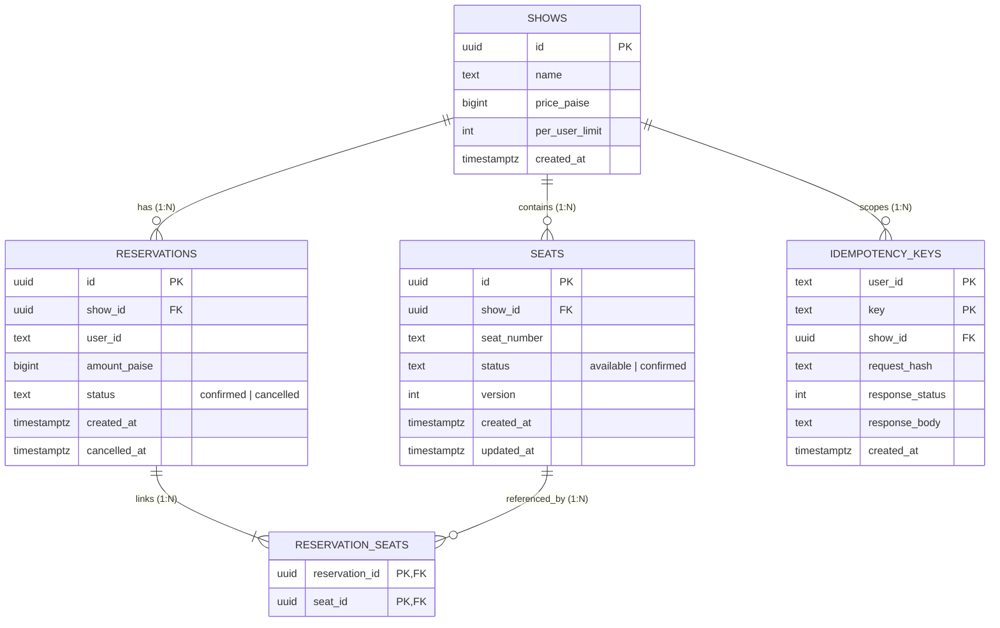

# 🎟️ Seat Reservation Service at Scale

[](https://golang.org)
[](https://www.postgresql.org)
[](https://www.docker.com)

A high-concurrency, race-free Seat Reservation API built for event on-sale stampedes. Designed to guarantee mathematical correctness under load: **zero double-selling**, **strict per-user booking limits**, **idempotent retries**, and **live observability**.

- **Live URL**: [https://golang-movie-seat-reservation-system.onrender.com](https://golang-movie-seat-reservation-system.onrender.com)
- **Readiness Probe**: [https://golang-movie-seat-reservation-system.onrender.com/ready](https://golang-movie-seat-reservation-system.onrender.com/ready)
- **Prometheus Metrics**: [https://golang-movie-seat-reservation-system.onrender.com/metrics](https://golang-movie-seat-reservation-system.onrender.com/metrics)

---

## 🎯 Key Engineering Guarantees

1. **Zero Double-Selling**: When hundreds of concurrent buyers race for the same hot seat at $t=0$, exactly **one** gets `201 Created`. All others get clean `409 Conflict` (`seat-taken`), **never a 500**.
2. **Reconciliation Invariant**: Holds to the exact unit at all times:

   $$\text{available} + \text{held} + \text{confirmed} = \text{total\_seats}$$

3. **Per-User Limits Under Concurrency**: A user firing 10 parallel reservation requests on a show with `per_user_limit = 4` ends up with at most 4 seats. Overages return clean `409 Conflict` (`per-user-limit`).
4. **Strict Idempotency**:
   - Replaying the same key returns the original reservation (`200 OK`).
   - Tampering with the payload for the same key is rejected with `409 Conflict` (`idempotency-conflict`).
5. **Clean Domain Error Separation**:
   - Existing seat already booked by another buyer $\rightarrow$ **`409 Conflict` (`reason: seat-taken`)**.
   - Requested seat does not exist in the show $\rightarrow$ **`400 Bad Request` (`reason: invalid-seats`)**.
6. **Token-Derived Identity**: Identity is extracted strictly from the `Authorization: Bearer <token>` header. Request bodies cannot spoof user IDs, and users can only cancel their own reservations.
7. **No Deadlocks on Multi-Seat Bookings**: Multi-seat requests sort seats deterministically before state transitions, preventing circular locking deadlocks.
8. **Integer Paise**: Money values are strictly represented as integer minor units (`BIGINT` paise), never floating point.

---

## 🏗️ Architecture & Database Schema



---

## ⚡ Quickstart (Clean Checkout via Docker)

A clean checkout runs out of the box with zero external dependencies required:

```bash
# 1. Clone the repository
git clone https://github.com/sh5800/seat-reservation-service.git
cd seat-reservation-service

# 2. Start PostgreSQL and the API service
docker compose up --build -d
```

Verify service readiness:

```bash
curl http://localhost:8080/ready
```

Expected: `{"status":"ready"}`

To tear down:

```bash
docker compose down -v
```

---

## 🚀 Running the Concurrency Burst Test

The repository includes a flexible load generator (`cmd/burst`) that simulates an on-sale stampede at $t=0$, concurrent idempotent retries, and greedy per-user limit stress.

### Script Syntax

```bash
./burst.sh [BASE_URL] [CONCURRENCY] [TARGET_SEAT]
```

- `BASE_URL`: Target endpoint (default: `http://localhost:8080`)
- `CONCURRENCY`: Number of concurrent buyers racing for the hot seat (default: `500`)
- `TARGET_SEAT`: Specific seat number to storm (default: `A12`)

### Examples

#### 1. Against Local Docker (Default: 500 buyers on A12)

**Linux / macOS:**

```bash
./burst.sh http://localhost:8080
```

**Windows (PowerShell):**

```powershell
.\burst.ps1 http://localhost:8080
```

#### 2. Against Live Production URL with Custom Concurrency & Seat

```bash
# 200 concurrent buyers storming seat A05 on the live server:
./burst.sh https://golang-movie-seat-reservation-system.onrender.com 200 A05

# Or in PowerShell:
.\burst.ps1 https://golang-movie-seat-reservation-system.onrender.com 200 A05
```

#### 3. Testing Contention on a Non-Existent Seat (e.g. Z99)

```bash
./burst.sh https://golang-movie-seat-reservation-system.onrender.com 50 Z99
```

Cleanly returns `400 Bad Request` (`invalid-seats`), proving non-existent seats are gracefully declined without server errors.

### Sample Output

```text
==============================================================
🎯 Executing Concurrency Burst against: https://golang-movie-seat-reservation-system.onrender.com
👥 Concurrency level : 500 requests
💺 Target Hot Seat   : A12
==============================================================
✅ Server readiness check passed!
✅ Created test show ID: b7fe7026-1ae8-4d7b-b148-5827c397119a with 50 seats (limit: 4)
🔥 Storming Hot Seat 'A12' with 500 concurrent buyers at t=0...
⏱️  Hot seat burst completed in 3.82s
🔁 Testing Idempotent Retries (50 concurrent calls with identical key)...
✅ Idempotent retries completed!
🛡️  Testing Per-User Limit (1 user attempting 10 concurrent seat reserves)...
✅ Per-user limit stress completed!
==============================================================
📊 BURST OUTCOME DISTRIBUTION
==============================================================
Total Requests Fired     : 560
✅ 201 Created (Wins)    : 6
🔁 200 OK (Idemp Replay) : 49
🚫 409 Conflict (Declined): 505
   ├─ Seat Taken         : 499
   ├─ Per-User Limit     : 6
   └─ Idemp Conflict     : 0
💥 5xx Server Errors     : 0
==============================================================
⚖️  FINAL RECONCILIATION INVARIANT CHECK
==============================================================
Total Seats              : 50
Available Seats          : 44
Held Seats               : 0
Confirmed Seats          : 6
Invariant Formula        : available(44) + held(0) + confirmed(6) == total(50)
🎯 RESULT: PASSED! Invariant holds exactly and zero 5xx errors recorded!
==============================================================
```

---

## 📡 API Reference

### 1. Health & Readiness Probes

- `GET /live`: Process liveness probe. Returns `200 OK`.
- `GET /ready`: Dependency readiness probe (pings PostgreSQL). Returns `200 OK` when healthy, fails closed with `503 Service Unavailable` if the database is down.
- `GET /metrics`: Standard Prometheus metrics endpoint.

### 2. Create Show (Admin)

`POST /shows`

Headers: `Authorization: Bearer <admin-token>`, `Content-Type: application/json`

```bash
curl -X POST http://localhost:8080/shows \
  -H "Authorization: Bearer admin-user" \
  -H "Content-Type: application/json" \
  -d '{
    "name": "rock-concert",
    "seats": ["A1","A2","A3","A4"],
    "price_paise": 25000,
    "per_user_limit": 4
  }'
```

### 3. Reserve Seats (Authenticated User)

`POST /shows/{id}/reserve`

Headers: `Authorization: Bearer <token>`, `Content-Type: application/json`

```bash
curl -X POST http://localhost:8080/shows/<SHOW_ID>/reserve \
  -H "Authorization: Bearer buyer-alice" \
  -H "Content-Type: application/json" \
  -d '{
    "seats": ["A1"],
    "idempotency_key": "alice-unique-key-001"
  }'
```

Responses:

- `201 Created`: Reservation confirmed.
- `200 OK`: Idempotent replay of a previously successful reservation.
- `409 Conflict`: Business decline (`{"error":"seat_taken","reason":"seat-taken"}` or `{"error":"limit_exceeded","reason":"per-user-limit"}`).
- `400 Bad Request`: Invalid request or non-existent seat (`{"error":"invalid_seats","reason":"invalid-seats"}`).
- `401 Unauthorized`: Missing or malformed Bearer token.

### 4. Cancel Reservation (Owner Only)

`POST /reservations/{id}/cancel`

Headers: `Authorization: Bearer <token>`

```bash
curl -X POST http://localhost:8080/reservations/<RESERVATION_ID>/cancel \
  -H "Authorization: Bearer buyer-alice"
```

> **Note:** Attempting to cancel a reservation owned by another user returns `403 Forbidden`.

### 5. Inspect Show State

`GET /shows/{id}`

```bash
curl http://localhost:8080/shows/<SHOW_ID>
```

---

## 📊 Observability & Metrics

Prometheus metrics exposed at `/metrics`:

- `reservations_confirmed_total`: Counter of confirmed seat reservations.
- `reservations_declined_total{reason="..."}`: Partitioned by `seat-taken`, `invalid-seats`, `per-user-limit`, `idempotency-conflict`.
- `reservations_idempotent_replays_total`: Counter for idempotent replays served.
- `http_requests_total{method, path, status}`: Request throughput by status code.
- `http_request_duration_seconds`: Request latency histogram.

All requests produce structured JSON logs (`log/slog`) with a unique correlation ID (`X-Correlation-ID` header) propagated throughout the request context.

---

## 🧪 Automated Tests

Run unit and integration tests (including the Go race detector):

```bash
go test -v -race ./...
```
